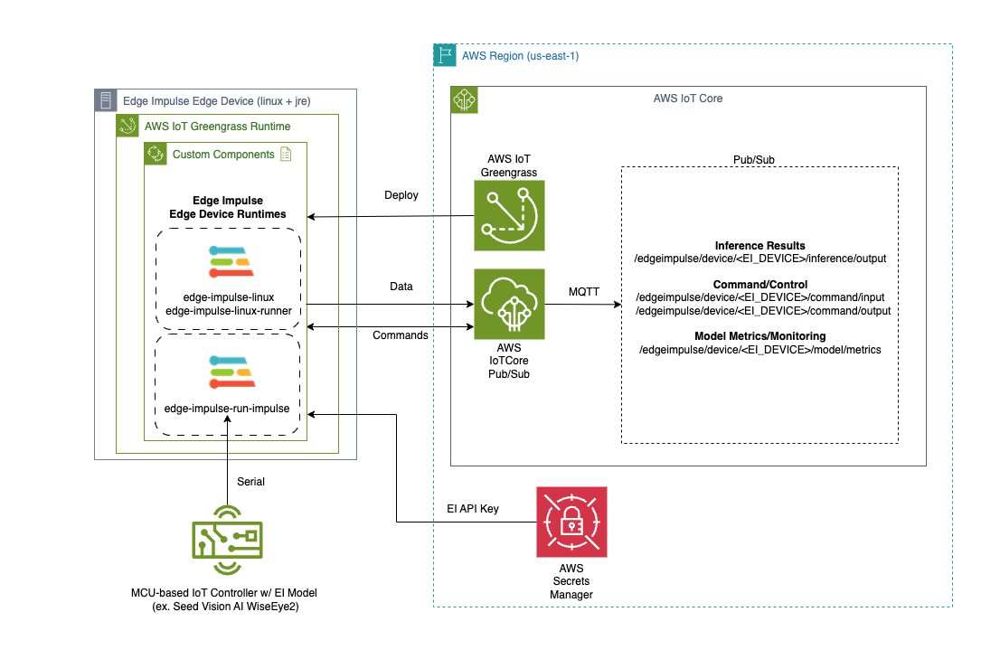

# Edge Impulse with AWS IoT Greengrass

AWS IoT Greengrass is an AWS IoT service that enables edge devices with customizable/downloadable/installable "components" that can be run to augment what's running on the edge device itself.  AWS IoT Greengrass permits the creation and publication of a "Greengrass Component" that is effectively a set of instructions and artifacts that, when installed and run, create and initiate a custom specified service. 

For more information about AWS IoT Core and AWS Greengrass please review: [AWS IoT Greengrass](https://docs.aws.amazon.com/greengrass/v2/developerguide/what-is-iot-greengrass.html)

## Overview

The Edge Impulse integration with AWS IoT Core and AWS IoT Greengrass is as follows:

A few notable items:

* Edge Impulse Linux/Runner services now have a "--greengrass" option that enables the integration. 
* AWS Secrets Manager is used to protect the Edge Impulse API Key by removing it from view via command line arguments
* The Greengrass Token Exchange Role must have Secrets Manager and IoT Core publication permission for the integration to operate correctly. 
* Edge Impulse has several custom Greengrass components that can be deployed and run on the Greengrass-enabled edge device for several purposes outlined below. The component recipes and artifacts can be found here: [Repo](https://github.com/edgeimpulse/aws-greengrass-components).

For more information regarding the Edge Impulse Linux/Runner please review: [Edge Impulse for Linux Node.js SDK](https://docs.edgeimpulse.com/docs/tools/edge-impulse-for-linux/linux-node-js-sdk).

#### "EdgeImpulseLinuxServiceComponent" Greengrass Component

The "edge-impulse-linux-service" allows a linux-based edge device to register itself to the Edge Impulse studio service as a device capable of relaying its sensory (typically, camera, microphone, etc...) to the Edge Impulse service to be used for data creation and model testing. The associated Greengrass component for this service allows for easy/scalable deployment of this service to edge devices. 


This component will attempt to capture camera devices so typically it cannot be installed in the same edge device that has the "edge-impulse-linux-runner" component (described below) at the same time.


#### "EdgeImpulseLinuxRunnerServiceComponent" Greengrass Component

The "edge-impulse-linux-runner" service downloads, configures, installs, and executes an Edge Impulse model, developed for the specific edge device, and provides the ability to retrieve model inference results.  In this case, our component for this service will relay the inference results into AWS IoT Core under the following topic:

		/edgeimpulse/device/<EdgeImpulseDeviceName>/inference/output
		

This component will attempt to capture camera devices so typically it cannot be installed in the same edge device that has the "edge-impulse-linux-runner" component (described prior) at the same time.
 

#### "EdgeImpulseSerialRunnerServiceComponent" Greengrass Component

The "edge-impulse-run-impulse" service is typically used when you want to utilize a MCU-based device to run the Edge Impulse model and you further want that device tethered to an edge device via serial/usb connections to allow its inference results to be relayed upstream.  Like with the "edge-impulse-linux-runner" service, the "edge-impulse-run-impulse" component will relay inference results into AWS IoT Core via the same topic structure:

		/edgeimpulse/device/<EdgeImpulseDeviceName>/inference/output

Next, we will being installation of AWS IoT Greengrass into our edge device!  Lets get started!
