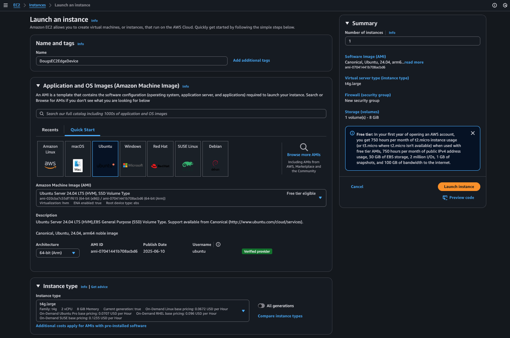
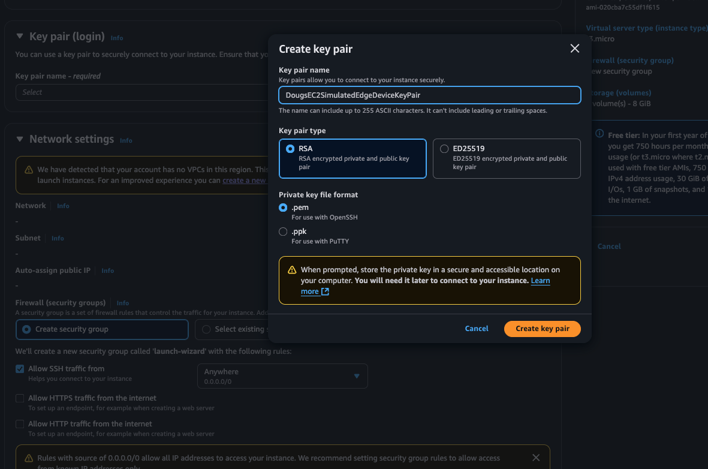
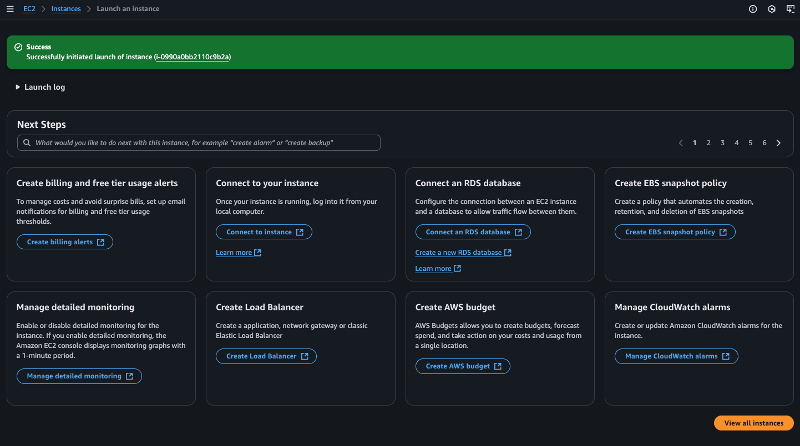

### Create Ubuntu EC2 Instance

AWS EC2 instances can be used to simulate edge devices when edge device hardware isn't available.  

We'll start by opening our AWS Console and search for EC2:

We'll now open the EC2 console page:

Select "Launch instance". Provide a Name for the EC2 instance and select the "Ubuntu" Quick Start option. Additionally, select "64-bit(Arm)" as the architecture type and select "t4g.large" as the Instance type:

Additionally, please click on "Create new Key Pair" and provide a name for a new SSH key pair that will be used to SSH into our EC2 instance. Press "Create key pair":

>**_NOTE:_**
>You will notice that a download will occur with your browser. Save off this key (a .pem file) as we'll use it shortly.

Next, we need to edit our "Network Settings" for our EC2 instance... scroll down to "Network Settings" and press "Edit":

Press "Add security group rule" and lets allow port tcp/4912:

Lets also give the EC2 instance a bit more disk space. Please change the "8" to "28" here:

Finally, press "Launch instance". You should see your EC2 instance getting created:

Now, press "View all instances" and press the refresh button... you should see your new EC2 instance in the "Running" state:

You can scroll over and save off your Public IPv4 IP Address. You'll need this to SSH into your EC2 instance. 

Lets now confirm that we can SSH into our EC2 instance. With the saved off pem file and our EC2 Public IPv4 IP address, lets ssh into our EC2 instance
  
>**_NOTE:_**
>In this example, my pem file is named	DougsEC2SimulatedEdgeDeviceKeyPair.pem and my EC2 instances' public IP address is 1.2.3.4

	chmod 600 DougsEC2SimulatedEdgeDeviceKeyPair.pem
	ssh -i ./DougsEC2SimulatedEdgeDeviceKeyPair.pem ubuntu@1.2.3.4

You should see a login shell now for your EC2 instance!

Excellent! You can keep that shell open as we'll make use of it when we start installing Greengrass a bit later. Lets proceed to the next step and get our Edge Impulse environment setup!

[Back](../0_Overview/Overview.md) [Next](../2_EdgeImpulseProjectBuild/EdgeImpulseProjectBuild.md)
