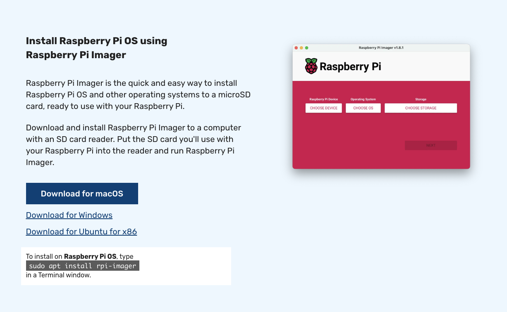

### Install RaspberryPi OS

The Raspberry Pi 5 is a super simple device that is fully supported by Edge Impulse and AWS as an edge device. 

First step in this exercise is to install the latest version of the Raspberry Pi OS onto your RPi. A SD card will be required and typically should be at least 16GB in size. 

The easiest way to setup Raspberry Pi OS is to follow the instructions here after downloading and installing the Raspberry Pi Imager application:

Instructions: [Install Raspberry Pi Imager](https://www.raspberrypi.com/software/)

Once installed and booted, your RPi5 device should be ready to install the Java runtime - a required component to run AWS IoT Greengrass "Classic".  Let's go!

[Back](../0_Overview/Overview.md) [Next](../2_EdgeImpulseProjectBuild/EdgeImpulseProjectBuild.md)