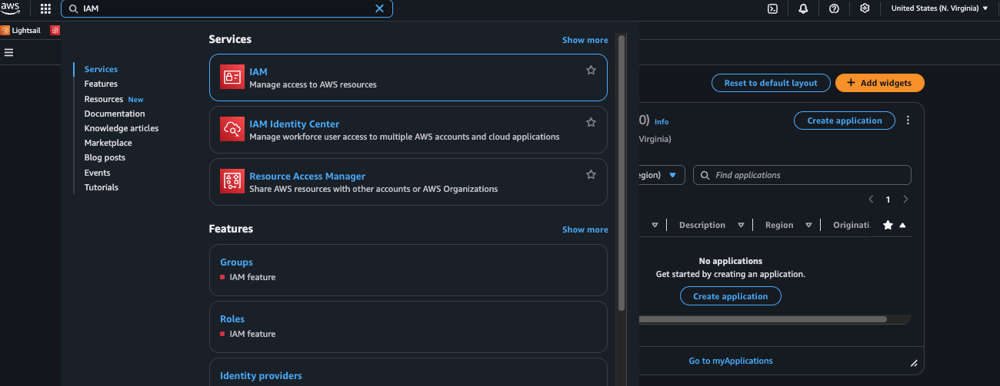
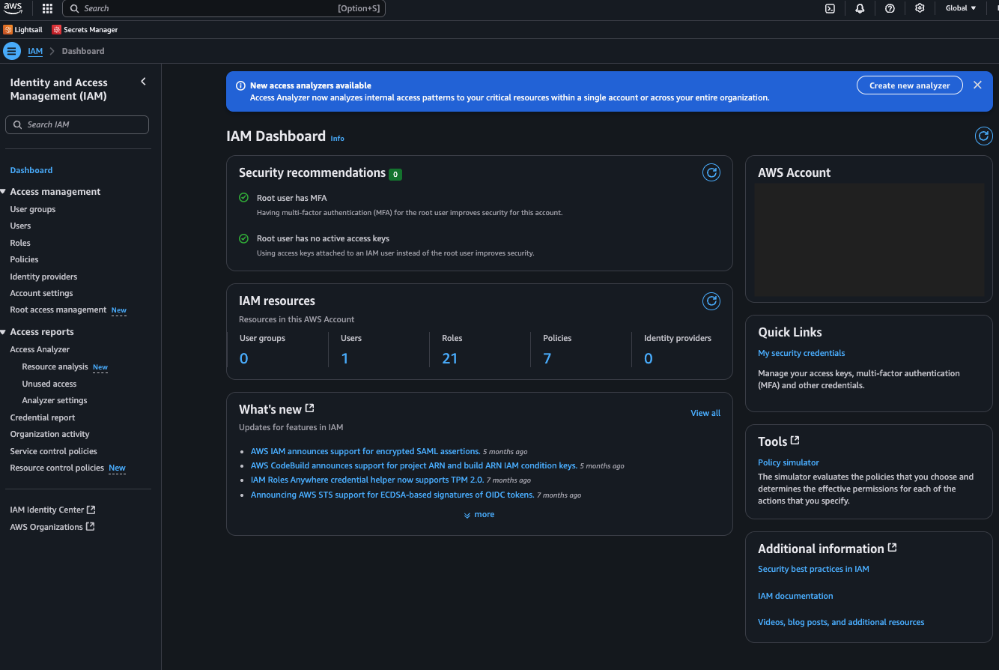
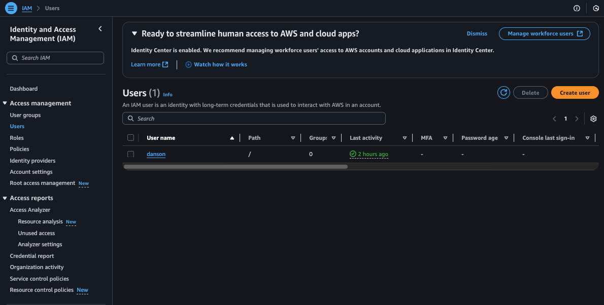
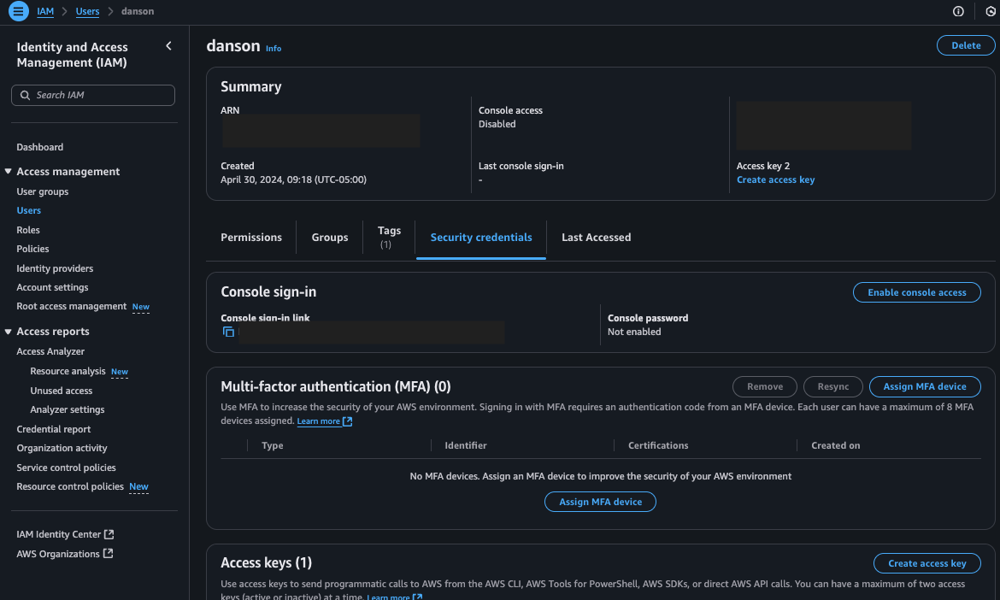
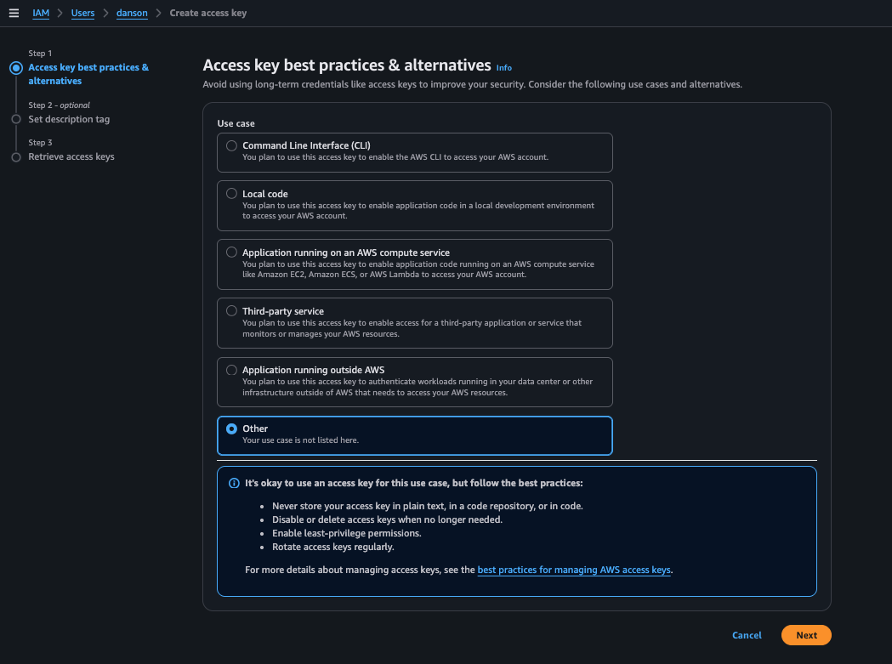
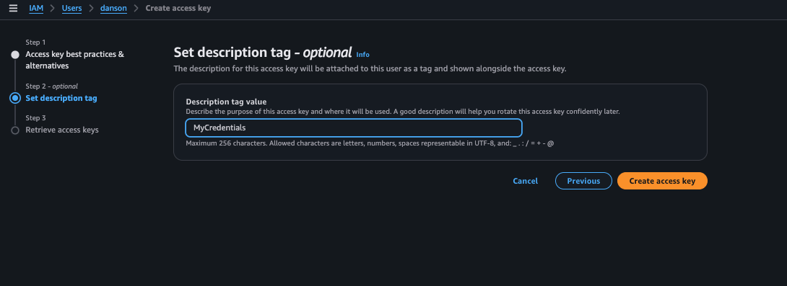
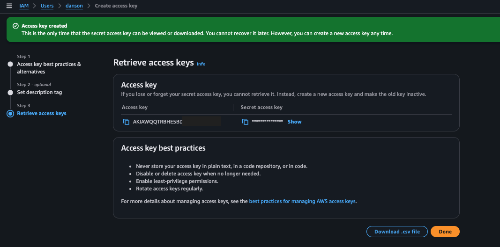
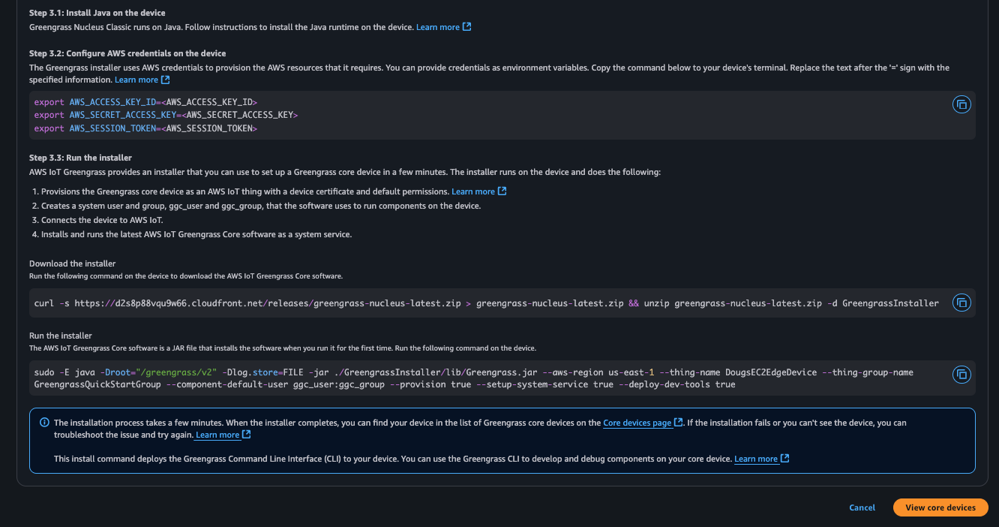
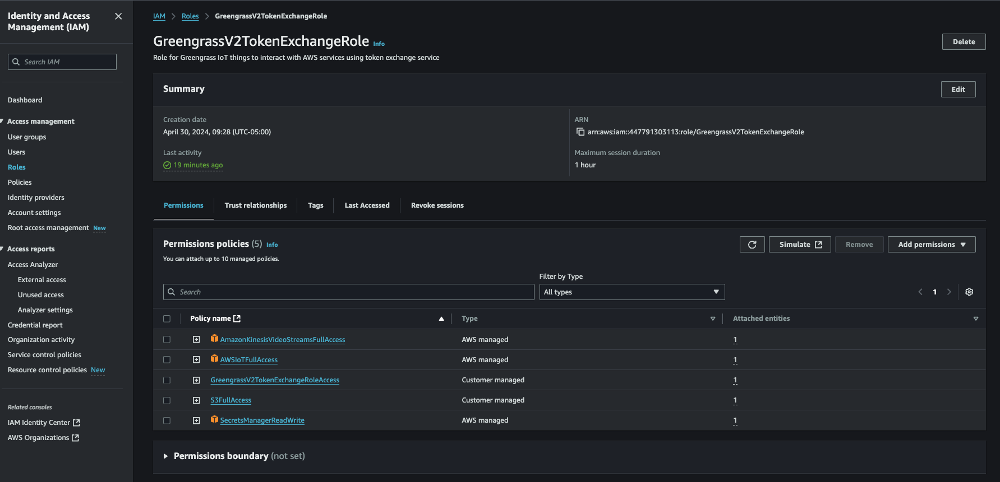

## AWS IoT Greengrass Installation

The following sections outline how one installs AWS IoT Greengrass onto our edge device.  AWS IoT Greengrass is ideal to use to create deployments of software and settings down to edge devices in a very scalable fashion.  

Log into your edge device via SSH and we'll start the process of installing/configuring Greengrass. 

### 1. Install AWS IoT Greengrass Prerequisites

AWS IoT Greengrass is based on Java and thus a Java runtime must be installed. For most linux-based devices a suitable Java can be run by simply typing:

	Ubuntu/Debian-based Edge Devices:
	
			% sudo apt update	
			% sudo apt install -y default-jdk unzip curl

	RedHat/Fedora-based Edge Devices: 

			% sudo yum install -y default-jdk

Additionally, its recommended to update your linux device with the latest security patches and updates if available. 

### 2. Create AWS Administrator Credentials

Prior to installing AWS IoT Greengrass, we need to create a set of AWS credentials that will be used as part of the installation process. 

>**_NOTE:_**
>These credentials may automatically be provided to you when you initiate the workshop has hosted by AWS Workshop Studio. If so, please copy the credentials as we'll need them in the next step. The credentials should look like this:
>
>		export AWS_ACCESS_KEY_ID=<AWS_ACCESS_KEY_ID>
>		export AWS_SECRET_ACCESS_KEY=<AWS_SECRET_ACCESS_KEY>

If you are using your personal AWS account and do not have the credentails created, you will need to create them. If you already have them, please skip the next step and proceed to step 3) below. 

#### 2a. Creating Access Credentials (personal AWS Accounts)

Please navigate to your AWS Dashboard and search for IAM:

Launch the IAM Dashboard:

Select "Users" from the left hand side of the dashboard:

Select your user, then select the "Security Credentials" tab:

Press "Create access key":

Choose "Other" and then press "Next":

Set a description for the access key and then press "Create access key"

You will now have the (only...) opportunity to copy and save off your credentials. Its best if you save them to a temp file that you'll read later in this format:

	export AWS_ACCESS_KEY_ID=<AWS_ACCESS_KEY_ID>
	export AWS_SECRET_ACCESS_KEY=<AWS_SECRET_ACCESS_KEY>

### 3. Install AWS IoT Greengrass

Greengrass is typically installed from within the AWS Console -> AWS IoT Core -> Greengrass -> Core Devices menu... select/press "Set up one core device". There are multiple ways to install Greengrass - "Nucleus Classic" is the version of Greengrass that is based on Java.  "Nucleus Lite" is a native version of Greengrass that is typically part of a Yocto-image based implementation. 

In this example, we choose the "Linux" device type and we are going to download the installer for Greengrass and invoke it as part of the installation of a "Nucleus Classic" instance:

Lower down in the menu, you will see the specific instructions that are custom-crafted for you to download and invoke the "Nucleus Classic" installer. Note that you will have to have previously created and set, within your shell environment, an AWS Access Key (typically with Administrator privilege) in order to run the installer:

 

### 4. Modify the Greengrass TokenExchange Role with additional permissions

When you run a Greengrass component within Greengrass, a service user (typically a linux user called "ggc_user" for "Nucleus Classic" installations) invokes the component, as specified in the lifecycle section of your recipe. Credentials are passed to the invoked process via its environment (NOT by the login environment of the "Greengrassc_user"...) during the invocation spawning process. These credentials are used by by the spawned process (typically via the AWS SDK which is part of the spawned process...) to connect back to AWS and "do stuff". These permissions are controlled by a AWS IAM Role called "GreengrassV2TokenExchangeRole".  We need to modify that role and add "Full AWS IoT Core Permission" as well as "AWS Secrets Manager Read/Write" permission.

To modify the role, from the AWS Console -> IAM -> Roles search for "GreengrassV2TokenExchangeRole", Then:

	1. Select "GreengrassV2TokenExchangeRole" in the search results list
	2. Select "Add Permissions" -> "Attach Policies"
	3. Search for "AWSIoTFullAccess", select it, then press "Add Permission" down at the bottom
	4. Repeat the search for "S3FullAccess" and "SecretsManagerReadWrite"

When done, your GreengrassV2TokenExchangeRole should now show that it has "AWSIoTFullAccess", "S3FullAccess" and "SecretsManagerReadWrite" permissions added to it.

Next, we will pull over and configure the EdgeImpulse Custom component used to deploy Edge Impulses' model execution runtime. Lets do this!

[Back](../2_EdgeImpulseProjectBuild/EdgeImpulseProjectBuild.md) [Next](../4_SecretsManagerSetup/SecretManagerSetup.md)