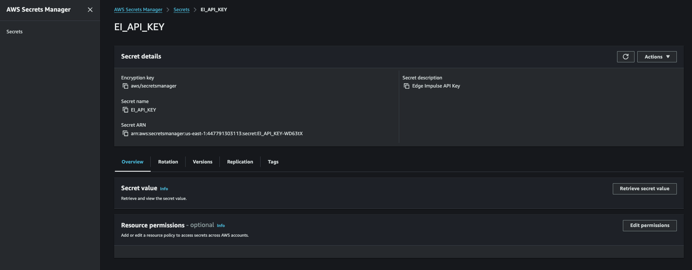

### Gather and install an EdgeImpulse API Key into AWS Secrets Manager

First we have to create an API Key in Edge Impulse via the Studio. 

Next, we will go into AWS Console -> Secrets Manager and press "Store a new secret". From there we will specify:

		1. Select "Other type of secret"
		2. Enter "ei_api_key" as the key NAME for the secret (goes in the "Key" section)
		3. Enter our actual API Key (goes in the "Value" section)
		4. Press "Next" 
		5. Enter "EI_API_KEY" for the "Secret Name" (actually, this is its Secret ID...)
		6. Press "Next"
		7. Press "Next"
		8. Press "Store"

Next we will install the EdgeImpulse Custom Greengrass Component we'll be using. 

