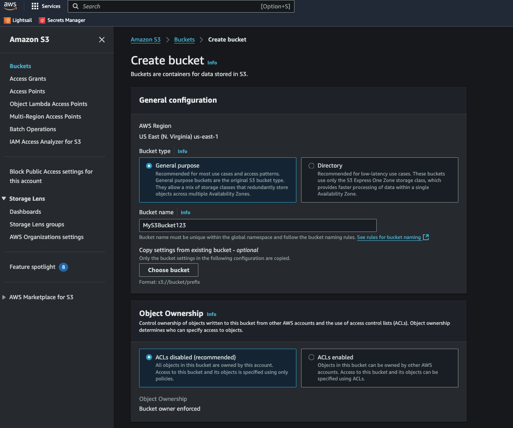

## Edge Impulse "Runner" Service Custom Component 

We will utilize a Greengrass "Custom Component" to create and deploy the Edge Impulse runner service (the service that will run our Edge Impulse model on the edge device) including the required additional prerequisites (NodeJS install, libvips install). AWS IoT Greengrass' custom component feature is ideal to create custom components that can be specialized to prepare, run, and shutdown a given custom service. 

Let's get started!

### 1. Clone the repo to acquire the Edge Impulse Component recipes and artifacts

Please clone this [repo](https://github.com/edgeimpulse/aws-greengrass-components) to retrieve the Edge Impulse component recipes (yaml files) and the associated artifacts.

### 2. Upload Edge Impulse Greengrass Component artifacts into AWS S3

First, you need to go to the S3 console in AWS via AWS Console -> S3. From there, you will create an S3 bucket.  For sake of example, we name this bucket "MyS3Bucket123". 

 

Next, the following directory structure needs to be created your new bucket:

		./artifacts/EdgeImpulseServiceComponent/1.0.0
		
Next, navigate to the "1.0.0" directory in your S3 bucket and then press "Upload" to upload the artifacts into the bucket. You need to upload the following files (these will be located in the ./artifacts/EdgeImpulseServiceComponent/1.0.0 from your cloned repo). Please upload all of these files into S3 at the above directory location:
			
		install.sh
		run.sh
		launch.sh					
		stop.sh
		
Your S3 Bucket contents should look like this:

		
### 3. Customize the component recipe files

Next we need to customize our Greengrass component recipe YAML file to reflect the actual location of our artifacts stored in S3.  Please replace ALL occurrences of "YOUR\_S3\_ARTIFACT\_BUCKET" with your S3 bucket name (i.e. "MyS3Bucket123"). Please do this to the "EdgeImpulseLinuxRunnerServiceComponent.yaml" file. Save the file.  

Also FYI, we can customize the defaulted configuration of your custom component by  editing, within "EdgeImpulseLinuxRunnerServiceComponent.yaml" file, the default configuration JSON. We won't need to do this for this workshop but its an useful option nonetheless. 

The default configuration in "EdgeImpulseLinuxRunnerServiceComponent.yaml" contains the following JSON configuration settings for the component:
    	
		EdgeImpulseLinuxRunnerServiceComponent.yaml:
		{
			"node_version": "20.12.1",
			"vips_version": "8.12.1",
			"device_name": "MyEdgeImpulseDevice",
			"launch": "runner",
			"sleep_time_sec": 10,
			"lock_filename": "/tmp/ei_lockfile_runner",
			"gst_args": "__none__",
			"eiparams": "--greengrass",
			"iotcore_backoff": "5",
			"iotcore_qos": "1",
			"ei_bindir": "/usr/local/bin",
			"ei_sm_secret_id": "EI_API_KEY",
			"ei_sm_secret_name": "ei_api_key",
			"ei_ggc_user_groups": "video audio input users",
			"install_kvssink": "no",
			"publish_inference_base64_image": "no",
			"enable_cache_to_file": "no",
			"ei_poll_sleeptime_ms": 2500,
			"ei_local_model_file": "__none__",
			"ei_shutdown_behavior": "__none__",
			"cache_file_directory": "__none__",
			"enable_threshold_limit": "no",
			"metrics_sleeptime_ms": 30000,
			"default_threshold": 50.0,
			"threshold_criteria": "ge",
			"enable_cache_to_s3": "no",
			"s3_bucket": "__none__",
		}
    	
#### Attribute Description

The attributes in each of the above default configurations is outlined below:

* **node\_version**: Version of NodeJS to be installed by the component
* **vips\_version**: Version of the libvips library to be compiled/installed by the component
* **device\_name**:  Template for the name of the device in EdgeImpulse... a unique suffix will be added to the name to prevent collisions when deploying to groups of devices
* **launch**: service launch type (typically just leave this as-is)
* **sleep\_time\_sec**: wait loop sleep time (component lifecycle stuff... leave as-is)
* **lock\_filename**: name of lock file for this component (leave as-is)
* **gst\_args**: optional GStreamer args, spaces replaced with ":", for custom video invocations
* **eiparams**: additional parameters for launching the Edge Impulse service (leave as-is)
* **iotcore\_backoff**:  number of inferences to "skip" before publication to AWS IoTCore... this is used to control publication frequency (AWS $$...)
* **iotcore\_qos**: MQTT QoS (typically leave as-is)
* **ei\_bindir**: Typical location of where the Edge Impulse services are installed (leave as-is)
* **ei\_ggc\_user\_groups**: A list of additional groups the Greengrass service user account will need to be a member of to allow the Edge Impulse service to invoke and operate correctly (typically leave as-is). For JetPack v6.x and above, please add "render" as an additional group. 
* **ei\_sm\_secret\_id**: ID of the Edge Impulse API Key within AWS Secret Manager
* **ei\_sm\_secret\_name**: Name of the Edge Impulse API Key within AWS Secret Manager
* **install\_kvssink**: Option (default: "no", on: "yes") to build and make ready the kvssink gstreamer plugin
* **publish\_inference\_base64\_image**: Option (default: "no", on: "yes") to include a base64 encoded image that the inference result was based on
* **enable\_cache\_to\_file**: Option (default: "no", on: "yes") to enable both inference and associated image to get written to a specified local directory as a pair: <guid>.img  and <guid>.json for each inference identified with a <guid>
* **cache\_file\_directory**: Option (default: "__none__") to specify the local directory when enable_cache_to_file is set to "yes"
* **ei\_poll\_sleeptime\_ms**: time (in ms) for the long polling message processor (typically leave as-is)
* **ei\_local\_model\_file**: option to utilize a previously installed local model file
* **ei\_shutdown\_behavior**: option to alter the shutdown behavior of the linux runner process. (can be set to "wait\_for\_restart" to cause the runner to pause after running the model and wait for the "restart" command to be issued (see "Commands" below for more details on the "restart" command))
* **enable\_threshold\_limit**: option to enable/disable the threshold confidence filter (must be "yes" or "no". Default is "no")
* **metrics\_sleeptime\_ms**: option to publish the model metrics statistics (time specified in ms). 
* **default\_threshold**: option to specify threshold confidence filter "limit" (a value between 0 < x <= 1.0). Default setting is 0.7
* **threshold\_criteria**:  option to specify the threshold confidence filter criteria (must be one of: "gt", "ge", "eq", "le", or "lt")
* **enable\_cache\_to\_s3**: option to enable caching the inference image/result to an AWS S3 bucket
* **s3\_bucket**: name of the optional S3 bucket to cache results into

### 4. Register the custom component via its recipe file

From the AWS Console -> IoT Core -> Greengrass -> Components, select "Create component". Then:

		1. Select the "yaml" option to Enter the recipe
		2. Clear the text box to remove the default "hello world" yaml recipe
		3. Copy/Paste the entire/edited contents of your "EdgeImpulseLinuxRunnerServiceComponent.yaml" file
		4. Press "Create Component"

If formatting and artifact access checks out OK, you should have a newly created component listed in your Custom Components AWS dashboard! 

Next we will create a Greengrass Deployment to deploy our custom component to our edge devices. 

[Back](../4_SecretsManagerSetup/SecretManagerSetup.md) [Next](../6_CustomComponentDeployment/CustomComponentDeployment.md)