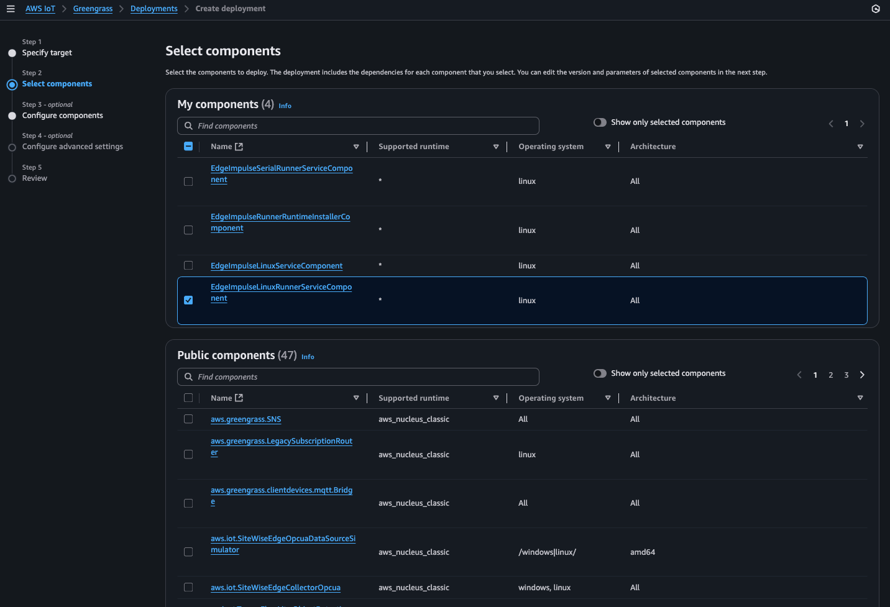
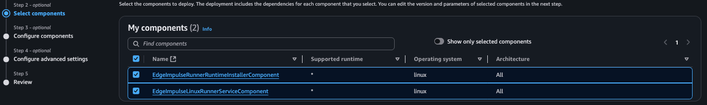
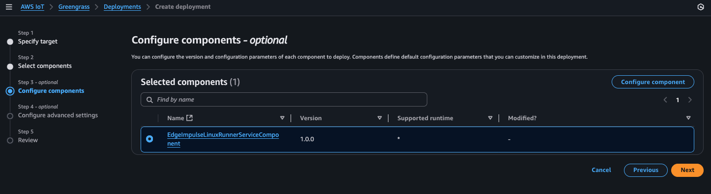
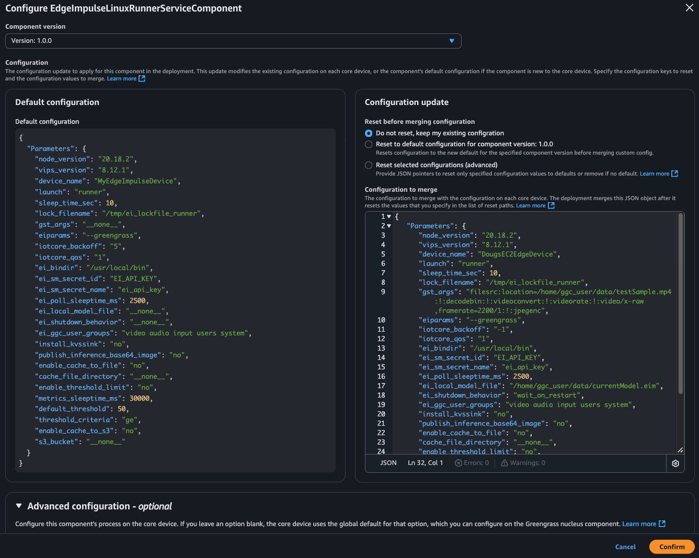
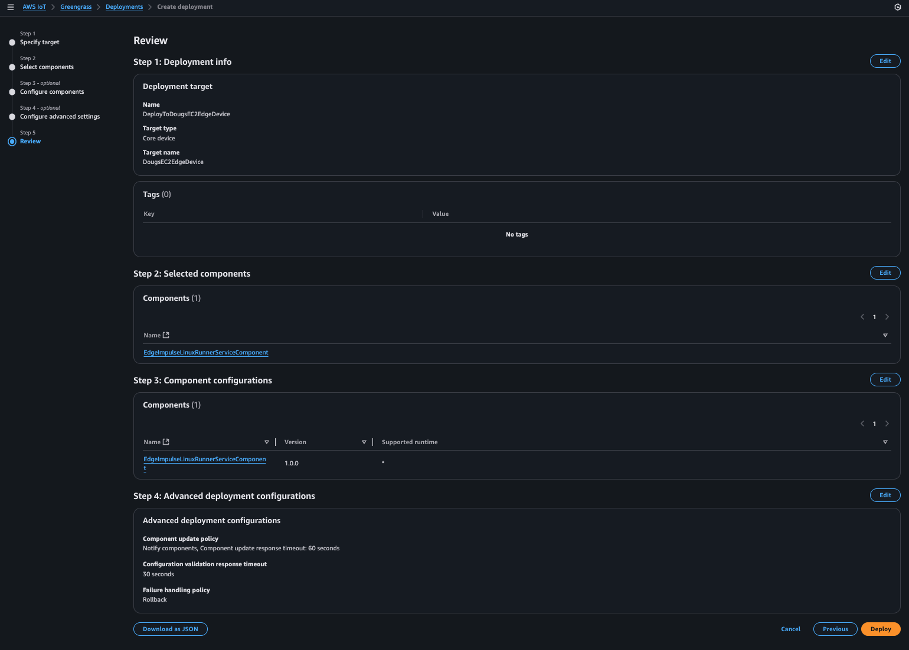

## Greengrass Component Deployment

In this section, we will create an AWS IoT Greengrass deployment that will download, prepare, install, and run our Edge Impulse "Runner" service on our edge device. When the  "Runner" service starts, it will connect back to our Edge Impulse environment via the API key we inserted into AWS Secret Manager and will download and start to run our deployed ML model we created in Edge Impulse Studio!  Let's get this started!

### 0. (Non-Camera Edge Devices Only): Additional Custom Component 

If your edge device does not contain a camera (i.e. EC2 edge device), you will need to deploy an additional custom component. Please follow [these steps](./NonCameraCustomComponent.md) to get the additional component created. You will be selecting this component in addition to the custom component we created for the Edge Impulse "Runner" service. 

### 1. Deploy the custom component to a selected Greengrass edge device or group of edge devices. 

Almost done!  We can now go back to the AWS Console -> IoT Core -> Greengrass -> Deployments page and select a deployment (or create a new one!) to deploy our component down to as selected edge device or group of gateways as needed: 

Deploy to a group of devices:

Deploy to a specific device (i.e. my EC2 Edge Device):

In either case above we now press "Next" and select our newly created custom component:

>**_NOTE:_**
>If you are using an edge device which does not have a camera, you will also need to select the "EdgeImpulseRunnerRuntimeInstallerComponent" custom component that you created above ("Non-Camera Edge Device Custom Component"):
>

Press "Next" again, then select our custom component and press "Configure Component" to configure the "Runner" component:

>**_NOTE:_**
>If you also have the Non-Camera component, it does NOT need to be configured... only the "EdgeImpulseLinuxRunnerServiceComponent" should be configured

We now see that our custom component has a default configuration. We can, however, customize it specifically for our specific deployment (i.e. to a specific device or group of similar devices...).  Lets customize our deployment by copying and pasting a new JSON into the "Configuration to merge" window followed by pressing "Confirm":

>**_NOTE:_**
>As an example for this particular JSON, I am customizing the "device\_name" parameter as well as the "gst\_args" to pull input from a file vs. camera. This will be dependent on the actual edge device being used in the workshop. In this particular JSON, the EC2 edge device is assumed to be used. Because the EC2 edge device has no camera, we have to direct the model, using our gstreamer arguments, to take input from a file. Your workshop instructor should provide you with the correct JSON for your particular workshop and edge device(s). The entire JSON used in the example is this and is suitable for edge devices like the EC2 edge device (note the device\_name!). Only the "device\_name" and "gst\_args" keys are modified from their defaults:
>
	{     
	   "Parameters": { 
	      "node_version": "20.18.2",
	      "vips_version": "8.12.1",
	      "device_name": "DougsEC2EdgeDevice",
	      "launch": "runner",
	      "sleep_time_sec": 10,
	      "lock_filename": "/tmp/ei_lockfile_runner",
	      "gst_args": "filesrc:location=/home/ggc_user/data/testSample.mp4:!:decodebin:!:videoconvert:!:videorate:!:video/x-raw,framerate=2200/1:!:jpegenc",
	      "eiparams": "--greengrass",
	      "iotcore_backoff": "-1",
	      "iotcore_qos": "1",
	      "ei_bindir": "/usr/local/bin",
	      "ei_sm_secret_id": "EI_API_KEY",
	      "ei_sm_secret_name": "ei_api_key",
	      "ei_poll_sleeptime_ms": 2500,
	      "ei_local_model_file": "/home/ggc_user/data/currentModel.eim",
	      "ei_shutdown_behavior": "wait_on_restart",
	      "ei_ggc_user_groups": "video audio input users system",
	      "install_kvssink": "no",
	      "publish_inference_base64_image": "no",
	      "enable_cache_to_file": "no",
	      "cache_file_directory": "__none__",
	      "enable_threshold_limit": "no",
	      "metrics_sleeptime_ms": 30000,
	      "default_threshold": 50,
	      "threshold_criteria": "ge",
	      "enable_cache_to_s3": "no",
	      "s3_bucket": "__none__" 
	   }  
	}  

Copy and paste the JSON into the "Configuration to merge" window and press "Confirm":

You'll then see the previous page and continue pressing "Next" until you get to the "Deploy" page:

> **_NOTE:_**
>When performing the deployment, its quite common to, when selecting one of our newly created custom components, to then "Customize" that component by selecting it for "Customization" and entering a new JSON structure (same structure as what's found in the component's associated YAML file for the default configuration) that can be adjusted for a specific deployment (i.e. perhaps your want to change the DeviceName for this particular deployment or specify "gst_args" for a specific edge device(s) camera, etc...). This highlights the power and utility of the component and its deployment mechanism in AWS IoT Greengrass.

> **_NOTE:_**
> The component deployment may take awhile depending on network speed/etc... the reason for this is that all of the required prerequisites to run the Edge Impulse "Runner" service have to be downloaded, setup, and installed. 
> 
> Back on the edge device via SSH, you can "tail" two different files to watch the progress of the installation/setup as well as the component operation (as root):
> 
> 		% sudo su - 
> 		# tail -f /greengrass/v2/logs/EdgeImpulseLinuxRunnerServiceComponent.log
> 		# tail -f /tmp/ei*log
> 
> The first "tail" will log all of the installation activity during the component setup. The second "tail" (wildcarded) will be the log file of the "running" component. You can actually watch the Edge Impulse "Runner" output in that file if you wish. 
> 
> Both files are critical for debugging any potential issues with the deployment and/or component configuration. 

Now that our custom component has been deployed, the component will install Edge Impulse's "Runner" runtime that will then, in turn, pull down and invoke our Edge Impulse's current Impulse (i.e. model...). We will next check that our model is running on our edge device!

[Back](../5_EdgeImpulseCustomComponentInstallation/EdgeImpulseCustomComponentInstall.md) [Next](../7_Running/Running.md)