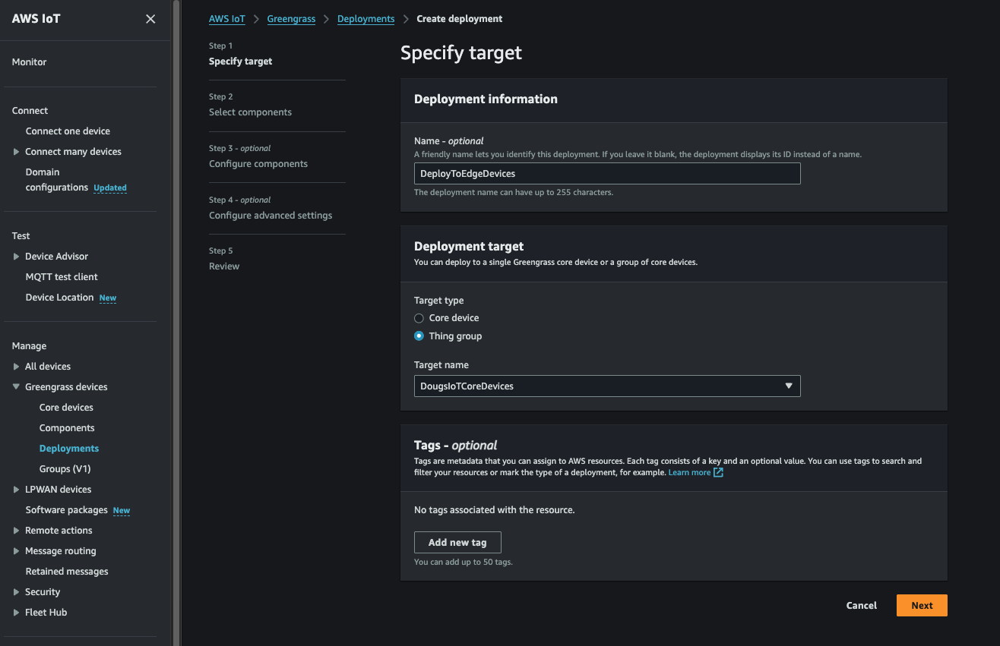

### Deploy the custom component to a selected Greengrass edge device or group of edge devices. 

Almost done!  We can now go back to the AWS Console -> IoT Core -> Greengrass -> Deployments page and select a deployment (or create a new one!) to deploy our component down to as selected gateway or group of gateways as needed. 

When performing the deployment, its quite common to, when selecting one of our newly created custom components, to then "Customize" that component by selecting it for "Customization" and entering a new JSON structure (same structure as what's found in the component's associated YAML file for the default configuration) that can be adjusted for a specific deployment (i.e. perhaps your want to change the DeviceName for this particular deployment or specify "gst_args" for a specific edge device(s) camera, etc...). This highlights the power and utility of the component and its deployment mechanism in AWS IoT Greengrass.

Now that our custom component has been deployed, the component will install Edge Impulse's "Runner" runtime that will then, in turn, pull down and invoke our Edge Impulse's current Impulse (i.e. model...). We will next check that our model is running on our edge device!

[Next](../7_Running/Running.md)