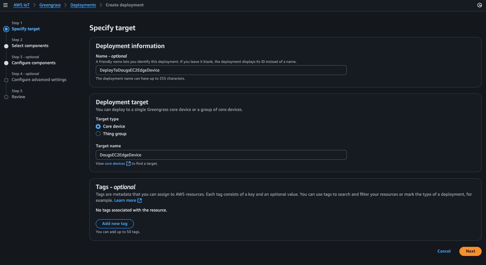

## Greengrass Component Deployment

### Deploy the custom component to a selected Greengrass edge device or group of edge devices. 

Almost done!  We can now go back to the AWS Console -> IoT Core -> Greengrass -> Deployments page and select a deployment (or create a new one!) to deploy our component down to as selected edge device or group of gateways as needed: 

Deploy to a group of devices:

Deploy to a specific device (i.e. my EC2 Edge Device):

In either case above we now press "Next" and select our newly created custom component:

Press "Next" again, then select our custom component and press "Configure Component":

We now see that our custom component has a default configuration. We can, however, customize it specifically for our specific deployment (i.e. to a specific device or group of similar devices...).  Lets customize our deployment by copying and pasting a new JSON into the "Configuration to merge" window followed by pressing "Confirm":

>**_NOTE:_**
>As an example for this particular JSON, I am customizing the "device\_name" parameter as well as the "gst\_args" to pull input from a file vs. camera. This will be dependent on the actual edge device being used in the workshop. In this particular JSON, the EC2 edge device is assumed to be used. Because the EC2 edge device has no camera, we have to direct the model, using our gstreamer arguments, to take input from a file. Your workshop instructor should provide you with the correct JSON for your particular workshop and edge device(s). 

You'll then see the previous page and continue pressing "Next" until you get to the "Deploy" page:

> **_NOTE:_**
>When performing the deployment, its quite common to, when selecting one of our newly created custom components, to then "Customize" that component by selecting it for "Customization" and entering a new JSON structure (same structure as what's found in the component's associated YAML file for the default configuration) that can be adjusted for a specific deployment (i.e. perhaps your want to change the DeviceName for this particular deployment or specify "gst_args" for a specific edge device(s) camera, etc...). This highlights the power and utility of the component and its deployment mechanism in AWS IoT Greengrass.

Now that our custom component has been deployed, the component will install Edge Impulse's "Runner" runtime that will then, in turn, pull down and invoke our Edge Impulse's current Impulse (i.e. model...). We will next check that our model is running on our edge device!

[Back](../5_EdgeImpulseCustomComponentInstallation/EdgeImpulseCustomComponentInstall.md) [Next](../7_Running/Running.md)